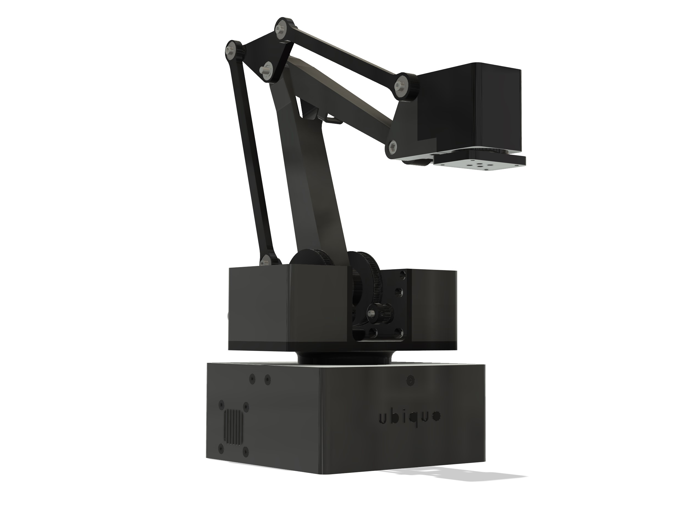
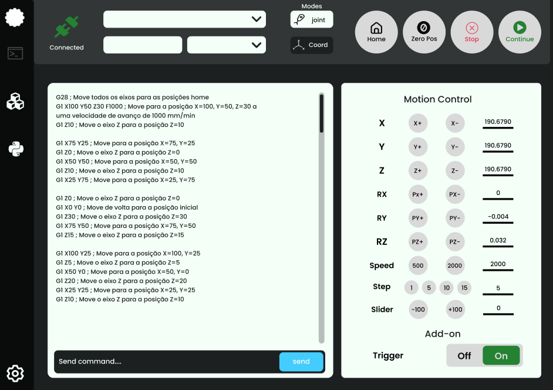

# Sonny Robot Arm

Sonny Robot Arm is an open-source, high-quality, and cost-effective 4-axis educational desktop robot arm. This project aims to provide a comprehensive learning experience in robotics while addressing common shortcomings found in open-source robot arms. The goal is to combine form and function, delivering a robot arm that is both affordable and offers uncompromised movement quality and payload capacity.

## Table of Contents
- [Repository Structure](#repository-structure)
- [Project Goals](#project-goals)
- [Key Features](#key-features)
- [Hardware](#hardware)
- [Software](#software)
- [Documentation](#documentation)
- [License](#license)
- [Contributing](#contributing)
- [Future Developments](#future-developments)

## Repository Structure

Sonny Robot Arm repository consists of the following Git submodules:
- **Sonny Firmware:** Contains the C++ firmware, implemented with an object-oriented approach, for the 4-axis robot arm.
- **Sonny Design Files:** Stores all hardware-related information and design files.
- **UROCS (Ubiquo Robot Operation Control Software):** A cross-platform GUI developed in Electron.js, providing users with control over the Sonny arm.
- **Documentation:** Comprehensive documentation to help users understand and work with the Sonny Robot Arm.

## Project Goals

The Sonny Robot Arm project was initiated with two primary objectives:

1. **Education:** To serve as an invaluable educational resource for those interested in robotics and automation. Sonny Robot Arm offers a hands-on learning platform for students, enthusiasts, and hobbyists to gain practical experience in robotics.

2. **Quality and Affordability:** To create a robot arm that strikes a balance between quality and affordability. The project focuses on minimizing costs while ensuring that the robot arm maintains exceptional movement quality and can handle payloads of up to 500 grams.

## Key Features

- **4-Axis Robot Arm:** Sonny Robot Arm is designed with 4 degrees of freedom (4 DoF), based on the kinematics of the ABB IRB 460, providing precise control over its movements.

- **Educational Desktop Robot:** This robot arm is tailored for educational purposes, offering an intuitive platform for learning about robotics, kinematics, and control systems.

- **Payload Capacity:** Despite its compact size, the robot arm can handle a maximum payload of 500 grams, making it suitable for various applications.

- **Robust Bearings:** All joints are equipped with double steel bearings, ensuring durability and smooth motion.

- **Motor Types:** The first three joints are powered by NEMA 17 stepper motors, while the fourth joint utilizes an MG90S servo motor with metal gears for reliability and precision.

- **Transmission:** Sonny Robot Arm features a tensioned belt-driven transmission with reducers in all stepper joints to minimize joint play and ensure accurate positioning.

- **Microcontroller:** The robot arm is controlled by an Arduino MEGA 2560 and a RAMPS 1.4 board.

- **Limit Switches:** All stepper joints include limit switches, enabling a homing calibration sequence during startup.

## Hardware

Sonny Robot Arm's hardware components are carefully selected and configured to achieve its educational and functional goals:

- **Stepper Motors:** NEMA 17 stepper motors power the first three joints to provide precise control over movement.

- **Servo Motor:** The fourth joint is driven by an MG90S servo motor with metal gears for reliable and accurate positioning.

- **Transmission:** Tensioned belt-driven transmission is employed, with reducers in all stepper joints to minimize play and ensure high-quality movement.

- **Microcontroller:** The robot arm is controlled by an Arduino MEGA 2560 and a RAMPS 1.4 board.

- **Limit Switches:** Limit switches are installed in all stepper joints to enable a homing calibration sequence during startup.

## Software

Sonny Robot Arm's software components include:

### Firmware (Sonny Firmware)

The firmware is responsible for controlling the robot, planning motion, and communicating with external systems. Key software components include:

- **Inverse Kinematics:** Sonny Firmware calculates the motion of each joint to achieve a desired end-effector position in Cartesian coordinates using inverse kinematics.

- **Interpolation:** The firmware calculates the trajectory and interpolation between points to ensure smooth and controlled movement of the robot arm.

- **Homing Calibration:** The robot arm includes limit switches in all stepper joints, allowing for a homing calibration sequence during startup.

### Control GUI Software (UROCS)

UROCS (Ubiquo Robot Operation Control Software) is a cross-platform GUI developed in Electron.js, providing users with an intuitive interface to control the Sonny arm. It enables users to interact with the robot, plan movements, and monitor its status easily.

## Documentation

Comprehensive documentation is available within the repository to assist users in understanding and working with the Sonny Robot Arm. This documentation covers hardware assembly, software setup, and usage instructions.

## License

Sonny Robot Arm is an open-source project released under a non-commercial license. Users are encouraged to freely use, share, and contribute to the project while adhering to the non-commercial usage terms.

## Contributing

We welcome contributions from the community to help improve and expand the Sonny Robot Arm project. Whether you're interested in code development, documentation, hardware design, or testing, your contributions are valuable. Please refer to the project's contribution guidelines for more information on how to get involved.

## Future Developments

Sonny Robot Arm is an evolving project with exciting future developments in mind. Some of the planned enhancements include:

- **URDF Integration:** Implementation of the Unified Robot Description Format (URDF) for easy import of the robot into simulation environments such as Gazebo, CoppeliaSim, and NVIDIA Isaac.

- **Custom Control Board:** Development of a custom ESP32-based control board to enhance performance and flexibility.

- **ROS 2 Integration:** Integration with Robot Operating System 2 (ROS 2) for enhanced control and communication capabilities.

- **Computer Vision:** Development of a computer vision system based on the NVIDIA Jetson Nano for vision-based tasks and applications.

- **Reinforcement Learning:** Exploration of reinforcement learning algorithms such as DDPG or PPO for solving simple tasks with the robot arm.

Thank you for your interest in Sonny Robot Arm, and we look forward to collaborating with you to make this project even better!
